 

  

  

<!-- ============ 01 ABOUT ============ -->

  

  

  <i>Final-year CSE student who pairs hands-on product development with research curiosity, 
  from full-stack platforms and cross-platform apps to a Bengali-script compiler, 
  while building the foundations for applied AI research.</i>

<!-- ============ 02 FOCUS ============ -->

  

  

<!-- ============ 03 STACK ============ -->

  

<table>
  <tr>
    <td align="right"></td>
    <td align="left">
      &nbsp;&nbsp;
      
      
      
    </td>
  </tr>
  <tr>
    <td align="right"></td>
    <td align="left"></td>
  </tr>
  <tr>
    <td align="right"></td>
    <td align="left"></td>
  </tr>
  <tr>
    <td align="right"></td>
    <td align="left"></td>
  </tr>
  <tr>
    <td align="right"></td>
    <td align="left"></td>
  </tr>
  <tr>
    <td align="right"></td>
    <td align="left">
      &nbsp;&nbsp;
      
    </td>
  </tr>
  <tr>
    <td align="right"></td>
    <td align="left">
      &nbsp;&nbsp;
      
      
    </td>
  </tr>
  <tr>
    <td align="right"></td>
    <td align="left">
      
      
      
      
      
    </td>
  </tr>
</table>

 

<!-- ============ 04 PROJECTS ============ -->

  

<table>
  <tr>
    <td width="50%" valign="top" align="center">
       
      
    </td>
    <td width="50%" valign="top" align="center">
       
      
    </td>
  </tr>
  <tr>
    <td width="50%" valign="top" align="center">
       
      
      
    </td>
    <td width="50%" valign="top" align="center">
       
      
      
    </td>
  </tr>
</table>

<b>Under the hood: how Suborno compiles</b>

 

<!-- ============ 05 RESEARCH ============ -->

  

  <b>Research interests:</b> Machine Learning, Artificial Intelligence and data-driven systems, 
  with a focus on applied AI for <b>education</b>, <b>healthcare</b> and <b>civic services</b>.

<!-- ============ 06 ANALYTICS ============ -->

  

 

  

  

<picture>
  <source media="(prefers-color-scheme: dark)" srcset="https://raw.githubusercontent.com/utsho0002/utsho0002/output/github-snake-dark.svg"/>
  <source media="(prefers-color-scheme: light)" srcset="https://raw.githubusercontent.com/utsho0002/utsho0002/output/github-snake.svg"/>
  
</picture>

  

  

<!-- ============ 07 EDUCATION ============ -->

  

  

<!-- ============ 08 CONTACT ============ -->

  

  

  

