 

   

  

   

  

   

  

<table>
  <tr>
    <td width="50%" valign="top" align="center">
       
      
    </td>
    <td width="50%" valign="top" align="center">
       
      
    </td>
  </tr>
  <tr>
    <td width="50%" valign="top" align="center">
       
      
      
    </td>
    <td width="50%" valign="top" align="center">
       
      
      
    </td>
  </tr>
</table>

  

  

  

